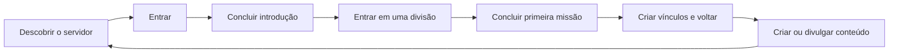

# Guia de implementação - funcionalidades, marketing e engajamento do Bot RPG

> Documento complementar a `Planejamento_Bot_RPG_Gangues.md`. Este guia define o que a IA deve construir, por que construir, como cada fluxo deve funcionar e quais proteções devem existir. A prioridade é fazer o servidor crescer e permanecer ativo sem transformar a comunidade em spam.

## 1. Missão do produto

Construir um bot de Discord que transforma uma comunidade em um RPG social de gangues com divisões, missões, temporadas, liderança e conteúdo compartilhável. O objetivo não é maximizar mensagens: é fazer novos membros sentirem pertencimento, criar motivos frequentes para voltar e recompensar contribuições que realmente ajudam o grupo.

### Fórmula de valor

```text
Entrada fácil + primeira conquista rápida + relações dentro de uma divisão
+ eventos recorrentes + reconhecimento público + recompensas justas
= comunidade que cresce e retém membros
```

### Princípios obrigatórios

1. Cada funcionalidade deve ter um motivo claro para existir: aquisição, ativação, retenção, comunidade, monetização ética ou segurança.
2. Não usar mecânicas que premiem spam, mensagens vazias, marcação em massa ou convites falsos.
3. Priorizar ações sociais saudáveis: ajudar, criar, participar, colaborar e receber bem novas pessoas.
4. Tudo que concede recompensa deve ser auditável, limitado e reversível.
5. O usuário deve entender o próximo passo em menos de cinco segundos.
6. A IA sugere, organiza e narra; pessoas autorizadas decidem sobre punições, promoções e aprovações externas.
7. O produto deve funcionar mesmo se a IA estiver indisponível.

## 2. Ciclo de crescimento do servidor

O bot deve medir e melhorar este ciclo:



### Métricas de referência

| Etapa | Métrica | Objetivo inicial |
| --- | --- | --- |
| Entrada | novos membros por origem | saber quais campanhas funcionam |
| Ativação | membro que conclui o onboarding em 24 h | > 45% |
| Primeira ação | membro que faz uma missão em 7 dias | > 35% |
| Retenção | retorno após 7 e 30 dias | acompanhar por coorte |
| Vínculo | participação em divisão/evento | aumentar gradualmente |
| Aquisição | convites qualificados | evitar volume artificial |
| Saúde | denúncias, spam e reversões | manter baixo e estável |

As metas devem ser configuráveis por servidor e apresentadas como tendências, não como julgamento de valor sobre pessoas.

## 3. Onboarding: transformar entrada em pertencimento

### Objetivo

Fazer cada novo membro chegar a uma primeira conquista em até dez minutos, com poucas escolhas e sem precisar entender todas as regras.

### Fluxo obrigatório

1. O bot envia uma mensagem privada ou mensagem de boas-vindas com botão `Começar jornada`.
2. Apresenta o conceito em três telas curtas: gangue, divisões e missões.
3. Pergunta apenas o essencial: apelido opcional, estilo de participação e escolha/entrada na divisão.
4. Cria o perfil de recruta e entrega uma missão simples de boas-vindas.
5. Apresenta o capitão, o vice-capitão e o canal da divisão.
6. Publica uma saudação opcional no mural da divisão, sem expor dados privados.
7. Após a primeira missão, entrega XP, uma conquista e recomenda a próxima ação.

### Primeiras missões recomendadas

- Reagir às regras para confirmar que leu.
- Apresentar-se usando um modelo curto.
- Participar de uma enquete sobre o próximo evento.
- Entrar no canal da divisão e cumprimentar alguém.
- Permanecer alguns minutos em uma chamada de recepção com pelo menos outra pessoa.

### Regras de UX

- No máximo três escolhas por tela.
- Sempre mostrar um botão `Pular por enquanto` quando a ação não for obrigatória.
- Não bloquear o acesso ao servidor por causa do RPG, a menos que o administrador configure isso de forma explícita.
- Não atribuir divisão a quem optou por não participar.
- Usar resposta privada para perfil e preferências.

## 4. Divisões: motor de pertencimento e competição saudável

### Funcionalidades a construir

- Criação, edição, arquivamento e reabertura de divisões.
- Cor, emblema, lema, canal, voz e limite de membros por divisão.
- Capitão, vice-capitão, oficiais e membros.
- Lista pública da divisão com proteção de dados pessoais.
- Mural da divisão com objetivo atual, placar e próximos eventos.
- Convites e pedidos de entrada aprováveis.
- Transferência de membro com motivo, período de espera e registro.
- Modo de balanceamento para limitar vantagem de equipes muito grandes.
- Ranking semanal, sazonal e histórico.

### Pontos de divisão

Os pontos devem vir de fontes variadas, para que a divisão não vença apenas por ter mais pessoas:

| Fonte | Peso | Limite | Observação |
| --- | ---: | ---: | --- |
| Missões coletivas | alto | por missão | principal objetivo cooperativo |
| Eventos oficiais | alto | por evento | requer presença válida |
| Missões individuais | médio | diário/semanal | soma contribuição distribuída |
| Acolhimento de novatos | médio | semanal | novato deve permanecer ativo |
| Conteúdo aprovado | médio | semanal | revisão humana quando externo |
| Bônus de diversidade | médio | semanal | recompensa participação de vários membros |
| Mensagens/reação válidas | baixo | diário | nunca deve dominar o ranking |

### Bônus de diversidade

Para evitar que poucos membros carreguem toda a divisão, calcular um bônus quando mais integrantes diferentes contribuem. Exemplo: uma missão coletiva recebe 100 pontos base; se cinco membros distintos contribuírem, pode receber até 25% extra. Nunca revelar métricas individuais que constranjam membros inativos.

## 5. Sistema de missões

### Tipos e finalidades

| Tipo | Frequência | Função principal | Exemplo |
| --- | --- | --- | --- |
| Tutorial | uma vez | ativação | completar perfil de recruta |
| Diária | diária | criar hábito | votar no tema do dia |
| Semanal | semanal | retenção | participar de evento ou chamada |
| Coletiva | semanal | colaboração | completar horas de voz em equipe |
| Narrativa | por capítulo | imersão | ajudar a defender o território |
| Criação | sob demanda | conteúdo orgânico | produzir meme, banner ou vídeo |
| Campanha | por período | aquisição | trazer novos membros qualificados |
| Retorno | acionada | reativação | voltar e participar de um evento |

### Estrutura de dados da missão

Cada missão deve conter:

- ID, servidor, temporada e divisão opcional.
- Título, descrição curta, história opcional e imagem/card.
- Objetivo de produto: ativação, retenção, aquisição, comunidade ou criação.
- Tipo de validação: automática, revisão humana, híbrida.
- Critério mensurável e fonte de dados.
- Público elegível, prazo, limite de tentativas e limite de recompensa.
- Pontos, XP, Honra, Influência, cosmético ou outro prêmio.
- Regras contra fraude e motivo de inelegibilidade.
- Estado: rascunho, agendada, ativa, em revisão, concluída, falha, cancelada.
- Autor, aprovador e histórico de mudanças.

### Validação automática: regras

Implementar validadores independentes por tipo. Cada validador retorna `eligible`, `progress`, `reason` e `evidence_reference`.

Exemplos:

- **Voz:** contabilizar somente períodos com duas ou mais pessoas elegíveis; ignorar auto-mute/afk prolongado conforme configuração; processar por intervalos, não por evento de entrada.
- **Texto:** considerar intervalo mínimo, tamanho mínimo e diversidade; ignorar mensagens repetidas, apagadas em seguida e canais excluídos.
- **Reação:** contar apenas reações em mensagens oficiais indicadas pela missão; uma por usuário, quando aplicável.
- **Evento:** usar check-in por botão, presença em voz ou confirmação do organizador.
- **Convite:** esperar período mínimo e atividade legítima do convidado antes de premiar.

### Validação de missões externas

Missões de marketing externas devem exigir comprovação. O sistema deve:

1. Exibir regras de divulgação permitida.
2. Solicitar URL e, se necessário, imagem de prova.
3. Associar a prova ao participante e à missão.
4. Detectar URL/prova repetida e limitar envios.
5. Permitir que moderador aprove, rejeite ou peça ajuste.
6. Registrar justificativa da decisão.
7. Entregar prêmio somente uma vez, dentro de transação.

Não prometer que é possível verificar automaticamente postagens privadas, stories que desaparecem ou interações de plataformas sem integração oficial.

## 6. Campanhas de marketing que geram membros melhores

### 6.1 Princípio: qualidade do membro, não quantidade de links

Uma campanha só é bem-sucedida se atrai pessoas que participam de forma legítima. O bot deve valorizar o ciclo completo:

```text
convite ou conteúdo -> entrada -> onboarding -> primeira ação -> retorno
```

### 6.2 Convite qualificado

#### Fluxo

1. Membro gera link de convite exclusivo pelo bot, se possuir permissão.
2. O link possui prazo, limite e identificação de campanha.
3. Convidado entra e realiza onboarding opcional.
4. O sistema aguarda uma janela configurável, por exemplo sete dias.
5. O convidado deve realizar atividade válida e não ser identificado como conta suspeita.
6. O membro que convidou recebe recompensa parcial ou total.
7. A divisão recebe pontos somente após a qualificação.

#### Proteções

- Não premiar auto-convite, bots ou contas duplicadas conhecidas.
- Aplicar tempo mínimo de criação da conta quando definido pelo servidor.
- Estabelecer teto diário e semanal de recompensas.
- Suspender campanha se a taxa de abandono for alta.
- Manter revisão para convites suspeitos.
- Não expor publicamente quem convidou quem, salvo opt-in.

### 6.3 Programa de embaixadores

Criar um cargo opcional de `Embaixador` para membros confiáveis. Ele não é moderador automaticamente. Benefícios possíveis:

- Missões exclusivas de conteúdo.
- Acesso antecipado a campanhas.
- Badge e moldura de perfil.
- Convite para reuniões de ideia.
- Pontos de Influência e premiações cosméticas.

Critérios: qualidade de conteúdo, respeito às regras, conversão/retensão e consistência. Nunca premiar assédio de potenciais membros ou spam de links.

### 6.4 Campanhas de conteúdo gerado pela comunidade

O bot deve oferecer campanhas prontas:

| Campanha | Entrega | Benefício para o grupo | Recompensa |
| --- | --- | --- | --- |
| Meme da semana | meme original | alcance e cultura interna | XP + destaque |
| Crônica da divisão | texto, clip ou arte | cria história compartilhável | Honra + título |
| Convite criativo | vídeo/banner | aquisição qualificada | Influência |
| Fanart do mascote | ilustração | identidade visual | cosmético raro |
| Recap do evento | vídeo ou thread | retenção e prova social | pontos da divisão |

Cada campanha deve ter brief simples, exemplos, prazo, formato aceito, direitos de uso e forma de avaliação. O bot precisa disponibilizar modelos de texto e uma área de envio.

### 6.5 Conteúdo compartilhável automático

Gerar cards com dados do RPG que os membros queiram compartilhar voluntariamente:

- Promoção a capitão ou vice.
- Vitória em evento ou batalha.
- Conquista rara.
- Sequência de participação.
- Colocação no ranking da semana.
- Novo emblema da divisão.
- Resultado de campanha coletiva.

Regras:

- Permitir ocultar nome, avatar e estatísticas.
- Não gerar card automaticamente em excesso.
- Usar uma ação explícita `Gerar card para compartilhar`.
- Entregar imagem com proporções de post e story quando existir recurso de imagem.
- Incluir marca discreta e URL/convite somente quando o usuário ou admin permitir.

### 6.6 Eventos que viram marketing orgânico

Eventos precisam ser bons mesmo para quem não divulga. Formatos:

- Torneio relâmpago entre divisões.
- Noite de quiz com placar visual.
- Votação de novo emblema.
- Caça a pistas dentro do servidor.
- Batalha de memes com final em evento de voz.
- Capítulo de temporada transmitido no canal de anúncios.
- Semana de acolhimento com recompensa para quem ajuda recrutas.
- Desafio criativo de vídeo, arte, música ou edição.

Para cada evento, construir: página/card de anúncio, RSVP, lembrete, check-in, placar em tempo real, resumo final e card compartilhável opcional.

## 7. Retenção: fazer membros voltarem

### 7.1 Rotina semanal recomendada

| Dia | Ação | Objetivo |
| --- | --- | --- |
| Segunda | novo objetivo da divisão | dar direção à semana |
| Terça | missão leve ou enquete | manter contato sem sobrecarga |
| Quarta | evento curto ou desafio | criar encontro social |
| Quinta | conteúdo da comunidade | reconhecimento |
| Sexta | batalha, quiz ou chamada | pico de participação |
| Sábado | atividade livre opcional | diversão sem pressão |
| Domingo | resumo, ranking e teaser | fechamento e antecipação |

O administrador pode alterar o calendário. O bot deve evitar excesso de notificações e respeitar fuso horário do servidor.

### 7.2 Sequências saudáveis

Sequências não devem punir pessoas por estudar, trabalhar ou viajar. Usar uma janela de recuperação: por exemplo, uma missão leve por semana preserva a sequência, e o membro pode usar um `dia de descanso` obtido no jogo. Não enviar mensagens de culpa.

### 7.3 Reativação respeitosa

Quando um membro participante fica inativo, disparar no máximo uma mensagem privada ou menção configurável após período definido. A mensagem deve oferecer contexto, não pressão:

> “Sua divisão está preparando a próxima operação. Se quiser voltar, há uma missão rápida esperando por você.”

Não enviar reativação a quem saiu do RPG, silenciou notificações ou bloqueou mensagens privadas.

### 7.4 Reconhecimento social

Criar rituais de reconhecimento:

- Destaque semanal por colaboração, criatividade, acolhimento e estratégia.
- Agradecimento de capitães a membros.
- Hall da fama da temporada.
- Badge de membro fundador, mentor e embaixador.
- Painel de boas-vindas para novos integrantes.

Não criar rankings públicos de “menos ativos”, “piores membros” ou “quem fala pouco”.

## 8. Economia e recompensas

### Moedas e significados

- **XP:** nível pessoal; ganho por atividade válida.
- **Honra:** ajuda e confiança; concedida em volume baixo e com mais controle.
- **Influência:** ações que fortalecem o crescimento; exige validação mais rigorosa.
- **Pontos da divisão:** competição sazonal; não é moeda individual.

### Recompensas recomendadas

- Títulos, bordas, emblemas, banners e efeitos de perfil.
- Acesso antecipado a eventos ou votações estéticas.
- Poder de sugerir tema de evento.
- Personalização de card.
- Itens narrativos e coleção da temporada.
- Reconhecimento em mural.

Não conceder privilégios permanentes de moderação, administração ou acesso a informações sensíveis como recompensa de jogo.

### Balanceamento

- Estabelecer fonte, teto e custo de cada item.
- Simular ganhos por usuário ativo antes de lançar moeda/loja.
- Usar limites semanais para recompensas de marketing.
- Separar itens cosméticos de vantagens temporárias.
- Registrar um livro-razão imutável de entradas e saídas.
- Criar ferramenta de reversão com motivo e auditoria.

## 9. Moderação, segurança e reputação

### Princípio

Capitães e vice-capitães podem ser moderadores, mas o RPG nunca substitui a segurança do servidor.

### Implementar

- Papéis narrativos separados de permissões reais do Discord.
- Matriz configurável de ações por função.
- Limites de duração, frequência e escopo por moderador.
- Motivo obrigatório em ação disciplinar.
- Log com autor, alvo, data, motivo, ação e resultado.
- Recurso e fila de revisão.
- Proteção de cargos superiores e membros protegidos.
- Painel de emergência que desativa poderes delegados.
- Métrica privada de atuação para admins, sem gamificar punições.

### IA na moderação

Pode resumir denúncias, agrupar repetição, apontar mensagens públicas potencialmente problemáticas e sugerir respostas. Não pode banir, expulsar, silenciar por período relevante, promover líder ou publicar acusação sem ação humana autorizada.

## 10. Interface: orientar para a próxima melhor ação

### Painel de membro

O painel principal deve mostrar no máximo:

1. Progresso da missão principal.
2. Situação da divisão e próximo evento.
3. Recompensa ou conquista recente.
4. Botão de ação principal: `Continuar missão`, `Entrar na chamada`, `Votar`, `Ver evento` ou `Convidar amigo`.

### Painel de liderança

Deve priorizar:

- Objetivo semanal da divisão.
- Membros novos para acolher.
- Propostas e provas pendentes.
- Evento mais próximo.
- Alertas de equilíbrio ou moderação.

### Painel administrativo

Deve ter:

- Funil de aquisição e retenção.
- Calendário de campanhas.
- Biblioteca de missões.
- Editor de card e identidade visual.
- Aprovações pendentes.
- Auditoria, regras e configurações.
- Sugestões de IA que exigem aprovação.

## 11. Automação inteligente e regras de acionamento

Criar jobs/filas para tarefas demoradas. Todo job deve ser idempotente, possuir deduplicação e registrar falhas.

| Gatilho | Ação automática | Limite/segurança |
| --- | --- | --- |
| novo membro | enviar onboarding | uma vez; respeitar DM bloqueada |
| onboarding concluído | entregar missão inicial | somente se participante |
| missão finalizada | calcular e registrar recompensa | transação + chave única |
| evento próximo | enviar lembrete | no máximo dois lembretes |
| temporada encerrada | congelar ranking e gerar resumo | revisão antes de publicar |
| prova enviada | criar tarefa de revisão | detectar duplicidade |
| convite qualificado | creditar influência | janela mínima + antifraude |
| inatividade elegível | sugerir retorno | opt-out e frequência baixa |
| anomalia de pontos | alertar administrador | nunca punir automaticamente |

## 12. Métricas, experimentos e melhoria contínua

### Dashboard mínimo

- Novos membros por campanha/origem.
- Conversão de entrada para onboarding concluído.
- Tempo até a primeira missão.
- Retenção por coorte em 7/30 dias.
- Participação por divisão, sem exposição constrangedora.
- Missões iniciadas, concluídas, abandonadas e revisadas.
- Eventos: RSVP, presença e retorno após evento.
- Convites enviados, qualificados e fraudados/revertidos.
- Conteúdos aprovados e desempenho agregado quando houver integração autorizada.

### Experimentos

Administradores podem testar uma variação por vez: horário de evento, texto de anúncio, recompensa, duração ou tipo de missão. O sistema deve:

1. Declarar hipótese e métrica antes de começar.
2. Dividir público somente se isso for justo e configurado.
3. Não experimentar com punições, privacidade ou segurança.
4. Encerrar após período definido.
5. Mostrar resultado com tamanho de amostra e observações, sem prometer causalidade se os dados forem insuficientes.

## 13. Modelos de campanha prontos

### Campanha A - Recrutamento da semana

- Objetivo: atrair membros que concluam onboarding e retornem.
- Público: embaixadores e membros elegíveis.
- Ação: gerar convite rastreável e card de divulgação.
- Recompensa: Influência escalonada por convite qualificado, com teto semanal.
- Métrica: convidados ativos após sete dias.
- Risco: contas falsas; mitigar com janela de qualificação e revisão.

### Campanha B - Guerra dos emblemas

- Objetivo: produzir conteúdo e aumentar identidade da comunidade.
- Público: divisões.
- Ação: criar emblema, banner, meme ou curta edição.
- Recompensa: pontos da divisão + cosmético para os participantes.
- Métrica: envios válidos e votação/participação.
- Regra: direitos de uso e proibição de conteúdo ofensivo ou copiado.

### Campanha C - Semana do recruta

- Objetivo: ativar novos membros e reduzir abandono inicial.
- Público: recém-chegados e mentores.
- Ação: sequência de três missões simples, cada uma social e opcional.
- Recompensa: título de recruta e item da temporada.
- Métrica: conclusão em sete dias e retorno na semana seguinte.

### Campanha D - Noite de operação

- Objetivo: criar pico de atividade e material para recap.
- Público: todas as divisões.
- Ação: quiz, chamada, batalha de memes ou caça a pistas.
- Recompensa: pontos coletivos e card de vitória.
- Métrica: presença, participação válida e retorno posterior.

### Campanha E - Crônica da comunidade

- Objetivo: gerar prova social e memória da temporada.
- Público: membros criativos.
- Ação: enviar relato, arte, clip ou foto permitida do evento.
- Recompensa: Honra e destaque no jornal.
- Métrica: número e qualidade de contribuições; aprovação humana.

## 14. Requisitos técnicos essenciais

### Arquitetura

- Bot em Node.js/TypeScript com Discord.js.
- Backend em NestJS com módulos separados por domínio.
- PostgreSQL para dados relacionais e livro-razão; MySQL apenas se for padrão já decidido pela equipe.
- Redis e fila para eventos, ranking, cards e notificações.
- Armazenamento de objetos para provas e cards gerados.
- React para painel web com login OAuth2 do Discord.
- Docker para desenvolvimento e implantação reproduzível.

### Regras de dados

- IDs Discord tratados como string/BigInt seguro.
- `guild_id` em todas as tabelas por servidor.
- Livro-razão para todo ponto, XP, moeda, item e reversão.
- Transações para recompensas, inventário, mudança de divisão e promoção.
- Auditoria para ações administrativas e de moderação.
- Retenção, exportação e exclusão de dados configuráveis.
- Secrets fora do código e logs sem tokens.

### Eventos Discord relevantes

- entrada/saída de membro.
- interações de slash command, botão, menu e modal.
- mensagem criada/atualizada/excluída apenas quando necessário e autorizado.
- reação adicionada/removida em missões definidas.
- mudança de estado em canais de voz.
- convite usado, quando disponível e comparável de modo confiável.
- alteração de cargos e permissões.

Se um evento não permitir atribuição confiável, o sistema deve optar por revisão ou não conceder recompensa, nunca adivinhar.

## 15. Modelo de permissão e autorização

Toda ação sensível deve verificar no backend:

1. Autenticação do usuário.
2. Vínculo com o servidor.
3. Papel no RPG.
4. Cargo real e hierarquia do Discord atual.
5. Escopo da divisão/canal.
6. Limites da ação.
7. Estado da temporada e da funcionalidade.
8. Proteções do alvo.

O frontend e as mensagens do bot podem ocultar ações indisponíveis, mas isso nunca substitui a validação no servidor.

## 16. Ordem de implementação obrigatória

### Marco 1 - Base segura

- Conexão Discord, configuração por servidor e permissões.
- Participação/opt-out, perfis e divisões.
- Ledger de pontos e auditoria.
- Missões automáticas de onboarding, texto, reação e voz.
- Ranking simples e painel do membro.

### Marco 2 - Liderança e eventos

- Capitão, vice, escopos e permissões delegadas.
- Missões de divisão e eventos com RSVP/check-in.
- Painel de liderança.
- Notificações e calendário.
- Controles antispam e reversões.

### Marco 3 - Marketing responsável

- Convites rastreáveis e qualificados.
- Submissão/revisão de provas externas.
- Biblioteca de campanhas.
- Cards compartilháveis e embaixadores.
- Dashboard de funil e retenção.

### Marco 4 - RPG avançado

- Temporadas, capítulos e batalha de divisões.
- Loja cosmética, conquistas e jornal.
- IA para rascunhos, resumo e sugestões.
- Experimentos, recomendações e integrações.

Não iniciar o Marco 4 antes de o Marco 3 demonstrar que as recompensas e o funil funcionam sem abuso.

## 17. Testes de aceite por funcionalidade

### Onboarding

- Membro novo conclui jornada sem usar comando de texto.
- Perfil é criado uma única vez.
- Opt-out impede qualquer pontuação futura.

### Missões e pontos

- Reprocessar evento não duplica prêmio.
- Um usuário não ultrapassa limite diário.
- Período de voz sozinho não conta.
- Prova rejeitada não concede Influência.
- Reversão mantém histórico completo.

### Convites

- Convite expira conforme regra.
- Entrada sozinha não gera prêmio.
- Membro que sai antes da janela não qualifica.
- Mesmo convidado não premia mais de uma origem.

### Liderança e moderação

- Capitão sem poder de admin não consegue ação administrativa.
- Vice não pune capitão ou admin.
- Toda punição registra motivo e autor.
- Remoção do cargo remove permissões delegadas.

### Privacidade

- Usuário exporta ou solicita exclusão conforme configuração.
- Mensagens privadas não são usadas em ranking.
- Notificações de reativação respeitam opt-out.

## 18. Instruções finais para a IA implementadora

1. Comece criando contratos de domínio e testes para pontos, missões, convite qualificado e autorização.
2. Implemente uma única campanha de cada vez, com painel de configuração e logs.
3. Para cada recompensa, defina fonte, requisito, limite, evidência, transação e reversão.
4. Para cada ação de marketing, defina como ela será validada sem depender de rastreamento impossível.
5. Para cada notificação, defina público, frequência máxima, opt-out e benefício claro.
6. Para cada métrica, defina finalidade e acesso permitido.
7. Não usar métricas de vaidade como objetivo final; priorizar membros ativos e bem acolhidos.
8. Não criar dark patterns, pressão de sequência, ranking humilhante ou pay-to-win.
9. Antes de publicar conteúdo de IA, permitir revisão em fluxos administrativos.
10. Quando existir dúvida entre crescimento e segurança, escolher segurança e registrar a necessidade de decisão humana.

## 19. Definição de sucesso da primeira versão pública

O produto está pronto para uma primeira comunidade real quando um administrador consegue instalar e configurar o bot em menos de quinze minutos; novos membros conseguem entrar em uma divisão e concluir uma missão no primeiro dia; líderes conseguem organizar eventos sem acesso administrativo excessivo; campanhas conseguem medir convites qualificados; as recompensas não duplicam; e os membros voltam porque desejam acompanhar a divisão e a temporada, não porque foram pressionados por notificações.
